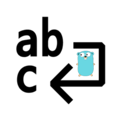

# go-textwrapper

[](https://pkg.go.dev/github.com/tiagomelo/go-textwrapper)



This tiny module provides a convenient way to wrap text in [Go](go.dev) apps.

## Installation

```shell
go get github.com/username/go-textwrapper
```

## Usage


```go
package main

import (
    "fmt"
    "github.com/tiagomelo/go-textwrapper"
)

func main() {
	text := "To be, or not to be, that is the question: Whether 'tis nobler in the mind to suffer The slings and arrows of outrageous fortune, Or to take arms against a sea of troubles And by opposing end them."
	wrappedText := textwrapper.Wrap(text, 40)
	for _, t := range wrappedText {
		fmt.Println(t)
	}
}
```

output:

```
To be, or not to be, that is the
question: Whether 'tis nobler in the mind
to suffer The slings and arrows of
outrageous fortune, Or to take arms
against a sea of troubles And by opposing
end them.
```

## unit tests

```
make test
```

## unit test coverage report

```
make coverage
```

## benchmark tests

```
make benchmark
```

Results (Macbook Pro with M3 chip, 18GB mem):

```
goos: darwin
goarch: arm64
pkg: github.com/tiagomelo/go-textwrapper
BenchmarkWrap/Simple_case-12         	 1844289	       655.0 ns/op
BenchmarkWrap/Single_long_word-12    	 2045685	       585.8 ns/op
BenchmarkWrap/Multiple_short_words-12         	 7852386	       152.9 ns/op
BenchmarkWrap/Exact_limit-12                  	14281902	        84.09 ns/op
BenchmarkWrap/Empty_input-12                  	855398960	         1.409 ns/op
BenchmarkWrap/Wide_characters-12              	 5004026	       240.6 ns/op
PASS
ok  	github.com/tiagomelo/go-textwrapper	9.614s
```

## Contributing

Contributions are welcome! If you find any issues or have suggestions for improvements, please open an issue or submit a pull request.

## License

This project is licensed under the MIT License. See the [LICENSE](LICENSE) file for more details.
